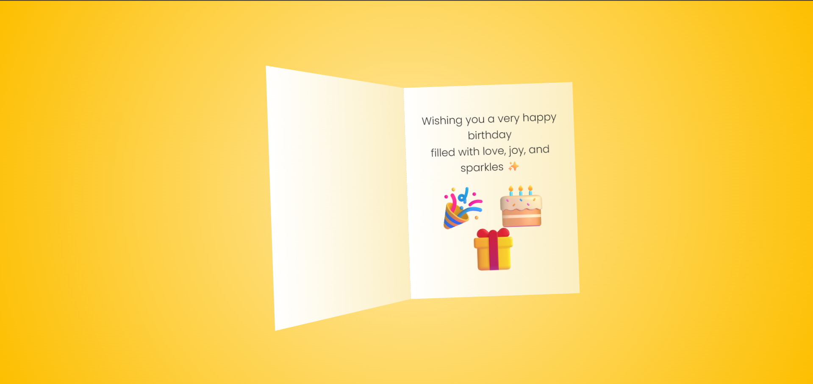

# 🎂 Birthday Card

An animated 3D birthday card built using **HTML** and **CSS**, perfect for sending heartfelt birthday wishes online. Hover to reveal the inside message and enjoy the delightful cake animation!

## ✨ Demo

 <!-- Replace with actual image path or remove if not available -->
 <!-- Replace with actual image path or remove if not available -->

## 📁 Project Structure

Birthday_Card/
├── index.html # Main HTML structure of the birthday card
├── style.css # All styling for the card and animation
├── images/ # (Optional) Store preview images/screenshots
└── README.md # This file

## 🛠️ Built With

- **HTML5**
- **CSS3**
- [Google Fonts: Pacifico, Poppins](https://fonts.google.com/)

## 🎉 Features

- 3D card flip animation on hover
- Custom layered birthday cake using pure CSS
- Interactive candle flame
- Responsive and centered layout

## 🚀 Getting Started

To view this project locally:

1. Clone the repo:
   ```bash
   git clone https://github.com/DevNatapohn/Birthday_Card.git